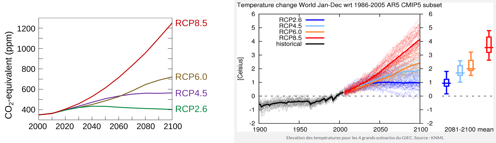

[](https://classroom.github.com/online_ide?assignment_repo_id=12403772&assignment_repo_type=AssignmentRepo)
# TD1: Simulation d'un modèle climatique simple
_Calcul Numérique, M1 CHPS, 2021-2022 Pablo Oliveira [<pablo.oliveira@uvsq.fr>]_

## Partie A: Preuve de la convergence de la méthode d'Euler explicite

Soit le problème de Cauchy suivant:

$$
        \left\{
        \begin{array}{l}
            y' = f(t,y(t))          \\
            y(t_0) = y_0, t_0 \in I \\
        \end{array}
        \right.
$$

avec $f$ définie sur $\mathbb{R} \times \mathbb{R} \rightarrow \mathbb{R}$.

La fonction $f(t, y(t))$ est continue et Lipschitzienne en $y$, c'est à dire

$$
\forall t,y_1,y_2, \exists k > 0, \qquad |f(t,y_1) - f(t,y_2)| \leq k|y_1-y_2|
$$

Soit $h > 0$ le pas d'intégration, la méthode d'Euler explicite s'exprime récursivement:

$$
\widetilde{y}_{n+1} = \widetilde{y}_n + hf(t_n, \widetilde{y}_n) \qquad t_n = nh
$$

On s'intéresse à l'erreur locale à l'étape $n+1$,

$$
|e_{n+1}| = |y(t_{n+1}) - \widetilde{y}_{n+1}|
$$

1. Montrer que $|e_{n+1}| \le (1+kh)|e_n| + mh^2$ où $k > 0$ et $m > 0$ sont constantes.

   _Conseils:_
   - Utiliser un développement de Taylor-Lagrange à l'ordre 2 de $y$
   - Utiliser le fait que $f$ est $k$-Lipschitzienne sur la deuxième variable

2. Poser $u_n = (1+kh)^{-n}e_n$ et montrer que $\sum_{i=0}^{n-1} |u_{i+1}| - |u_{i}| \le \frac{m}{k}h$.

   _Conseils:_
   - Utiliser la majoration montrée dans la question précédente
   - Rappel: $\sum_{i=0}^{n-1}a^i = \frac{a^n-1}{a-1}$ pour $a$ constante

3. Montrer que $|e_n| \le (1+kh)^n(|e_0| + \frac{m}{k}h)$

   _Conseils:_
   - Sommer télescopiquement $\sum_{i=0}^{n-1}|u_{i+1}| - |u_{i}|$

4. Montrer que $|e_n| \le e^{khn}(|e_0|+\frac{m}{k}h)$

   _Conseils:_
   - Montrer que $(1+kh) \le e^{kh}$

5. Montrez que $\forall n,\;\lim_{h \rightarrow 0} |e_n| = 0$ lorsque $\widetilde{y}_0 = y(t_0)$. Que pouvez vous dire sur la vitesse de convergence ?

## Partie B: Un modèle climatique simple

Dans cette partie nous souhaitons simuler le réchauffement climatique par un modèle simple de l'effet de serre.

Le modèle utilisé est une simplification du modèle utilisé dans les logiciel [SimClimat](https://www.lmd.jussieu.fr/~crlmd/simclimat/) développé par Camille Risi et [py-simclimat](https://gitlab.in2p3.fr/alexis.tantet/py-simclimat) développé par Alexis Tantet.

### Description du modèle

La figure ci-dessous, extraite du rapport du [GIEC](https://www.ipcc.ch/languages-2/francais/) 2007, schématise l'effet de serre naturel.


Pour modéliser l'effet de serre, nous allons utiliser un modèle radiatif global.

- Radiatif: car nous allons faire le bilan énergétique des rayonnements entrants et sortants.
- Global: car nous considérons la terre comme un seul point et ne modélisons pas des phénomènes localisés.

#### Puissance entrante

La puissance entrante est due au rayonnement solaire. Elle correspond à $S_0/4$ où la constante solaire $S_0=1370W.m^{-2}$. Le facteur $\frac{1}{4}$ est nécessaire car seulement un quart du globe est éclairé par le soleil à chaque instant.

Néanmoins une partie de ce rayonnement est reflété par la terre et l'atmosphère. L'albedo planétaire, $\alpha$, est la fraction du rayonnement reflété.

Ainsi, la puissance entrante est

$$P_{in} = (1-\alpha)\frac{S_0}{4}$$

#### Puissance sortante

La puissance sortante est émise sous forme d'infrarouges par la surface de la terre. En considérant que la terre est un corps noir, elle peut-être calculée avec la formule $\sigma.T^4$ où $\sigma$ est la constante de Stefan-Boltzmann et $T$ est la température.

À nouveau, une partie du rayonnement infrarouge est absorbé et rediffusé par l'atmosphère dans toutes les directions. Ce phénomène, appelé l'effet de serre, conserve une partie de l'énergie infrarouge réémise.

La fraction d'énergie conservée est modélisée par $G(t,T)$.
Donc, la puissance sortante s'écrit

$$P_{out} = (1-G(t, T))\sigma T^4$$

#### Calcul de $G(t,T)$

 $G(t, T)$ dépends de la quantité de gaz à effet de serre dans l'atmosphère à un instant $t$. Ici pour simplifier, on s'intéressera uniquement aux deux gaz à effet de serre ayant l'effet le plus important: la vapeur d'eau et au dioxyde de carbone (CO$_2$).

 Le dioxyde de carbone présent dans l'atmosphère peut être d'origine naturel (activité volcanique, géothermique, incendies naturels, etc.) ou d'origine anthropique, c'est à dire produit par l'activité humaine. Depuis plusieurs décennies, les émissions anthropiques sont en forte croissance et responsables de la crise climatique actuelle.

La quantité de vapeur présente dans l'atmosphère dépends de la température, en effet lorsqu'elle augmente il y a plus d'évaporation.

Dans ce TP nous modéliserons $G$ avec un modèle linéaire qui dépend de la concentration en CO$_{2}$ exprimée en ppm et de la température $T$,

 $$ G(t,T) = 0.0033507 \times T + 0.000032099 \times C_{CO_2}(t) - 0.56159 $$

Ce modèle linéaire est une approximation du modèle plus complexe décrit dans le  [modèle SimClimat](https://www.lmd.jussieu.fr/~crlmd/simclimat/documentation_2019/node7.html).

#### Variation de la température

Dans notre modèle la température varie en fonction du bilan radiatif
$$dT = (P_{in} - P_{out}) \times \frac{dt}{100}$$
où $dt$ est une variation du temps $t$ exprimé en années.

La constante 100 modélise l'inertie de changement de température.

1. Dans le fichier `simulation.c`, rajouter les fonctions `real P_in(void)` et `real P_out(real t, real T)` qui calculent les puissances en entrée et en sortie du système terre.

   Conseil: Utiliser l'alias `real` pour les types flottants car cela nous permettra de changer facilement d'une représentation `double` vers une représentation `float` (simple précision).

2. Rajouter la fonction `real F(real t, real T)` qui calcule la différence de température $dT$ selon la formule ci-dessus.


### Intégration temporelle

Nous souhaitons prédire l'évolution de la température avec le modèle précédent.

1. Montrer que le modèle peut-être intégré sur le temps avec la méthode d'Euler explicite. Écrivez la formule permettant de calculer la température $\widetilde{T}_{n+1}$ à partir de $\widetilde{T}_{n}$.


2. Rajouter une fonction `real euler(real t_final, int steps)`. La fonction utilisera un schéma d'Euler explicite pour simuler la température à $t_0+t_{final}$; on choisira le pas d'intégration de manière à effectuer $steps$ itérations avec la formule $h = \frac{t_{final} - t_{0}}{steps}$.

3. Modifier la fonction précédente de manière à pouvoir imprimer à chaque itération l'année $t$ et la température $T$ en Kelvins.

4. Réaliser une simulation sur 100 ans (donc de 2007 à 2107). Utilisez un logiciel de tracé (comme par exemple `gnuplot`) pour tracer la courbe de températures obtenues.

Si vous utilisez gnuplot un script `plot-simulation.gp` est inclus.
Il attends un fichier `output.dat` avec deux colonnes séparées par une espace, la première colonne est l'année et la deuxième la température. Vous pouvez afficher le tracé avec la commande:

```bash
$ gnuplot plot-simulation.gp
```


### Validité du modèle et discussion

Le GIEC (Groupe d'experts intergouvernemental sur l'évolution du climat) réunit des scientifiques en sciences du climat et de nombreuses autres disciplines qui depuis trente ans maintenant étudient et produisent des rapports sur l'évolution du climat.

Pour réduire le réchauffement climatique le levier d'action le plus direct est la réduction des émissions de $CO{_2}$ anthropiques.
Le GIEC étudie plusieurs scénarios, nommés RCP (_Representative Concentration Pathways_), d'évolution de la concentration de $CO{_2}$. La figure gauche ci-dessous trace le profil des quatre RCP considérés.  La figure à droite capture les prédictions du GIEC pour ces différents scénarios sur l'élévation de la température.



Dans cette partie nous allons comparer notre modèle simple avec les projections du GIEC qui se basent sur des simulations bien plus complexes.

1. Modifiez votre programme pour pouvoir faire varier la concentration de dioxyde de carbone en fonction de $t$. Vous pouvez, par exemple, considérer un taux de variation constant par année.
2. Tracez les courbes de température pour des scénarios proche de RCP6.0 et RCP2.6.
3. Comparez les résultats obtenus avec ceux du GIEC. Commentez ?
4. Lisez la FAQ12.1 « Why are so many models and scenarios used to project climate change?» en page 1036 du [rapport du groupe 1AR5 DU GIEC de 2018](https://www.ipcc.ch/site/assets/uploads/2018/02/WG1AR5_Chapter12_FINAL.pdf). Discuter les limites de notre modèle à la lumière de cette lecture. Donner des exemples de phénomènes physiques qui ne sont pas pris en compte.

### Erreurs numériques du modèle

Pour cette partie on va garder la concentration en dioxyde de carbone fixe à sa valeur initiale en 2007.

1. Simuler la température en 2107 avec un 1000 itérations et affichez l'ensemble des chiffres du résultat en double précision. Garder la valeur obtenue qui sera utilisée comme référence pour la suite.

2. Changer la définition de `real` de manière à utiliser la simple précision lors des calculs.

3. Implémenter une fonction `errors()` qui exécute la simulation pour un nombre d'itérations croissant de manière exponentielle: 16,32,64,128, ..., 65536. Lors de ces exécutions vous n'afficherez pas les valeurs au fur à mesure de la simulation.

4. Modifier `errors()` de manière à afficher l'erreur obtenue en fin de simulation pour chacune des exécutions. L'erreur numérique sera calculée par rapport à la valeur de référence obtenue en B.1.

5. Tracer la courbe d'erreur en fonction du nombre d'itérations. Utilisez une échelle logarithmique en abscisses et ordonnées.
   Dans `gnuplot` vous pouvez utiliser la commande `set logscale xy 2`.
   Vous devriez obtenir une courbe semblable à la figure ci-dessous.

6. À l'aide des éléments vus en cours expliquez le profil de la courbe. Pourquoi l'erreur diminue de 16 à 1024 itérations ? Pourquoi l'erreur augmente de 1024 à 65536 itérations ? Les variations semblent linéaires, est-ce que la théorie explique ce résultat ?

{ width=400px }
